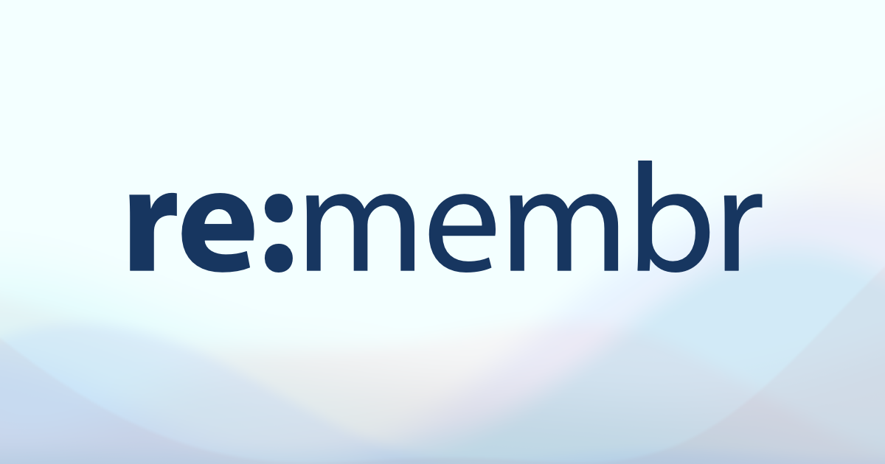

# re:membr
A minimal vocabulary & task card app built with Next.js + TypeScript.

## Tech Stack
- Next.js (App Router)
- TypeScript
- Tailwind CSS
- Redux Toolkit

## Status
coming soon...

## Live Demo
https://remembr.vercel.app

## Documentation
- [Setup and Development Guide](./docs/setup.md)

## Local Development
### Installation
```sh
$ yarn
```

### Start the Development Server
```sh
$ yarn dev
```

### Lint Check
```sh
$ yarn lint
```

## License
[MIT License](LICENSE)

## Author
&copy;2025 [SUWA Hiroyuki / 諏訪宏幸](https://github.com/hiroyuki-suwa/)
